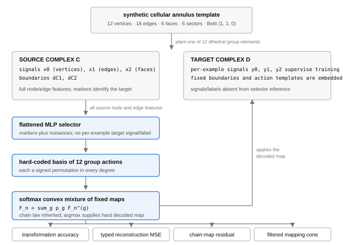
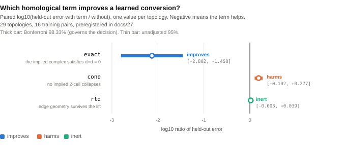
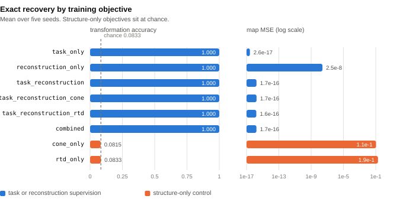
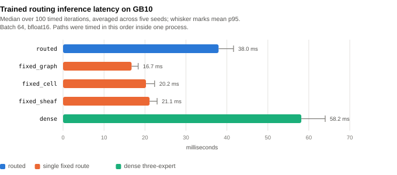
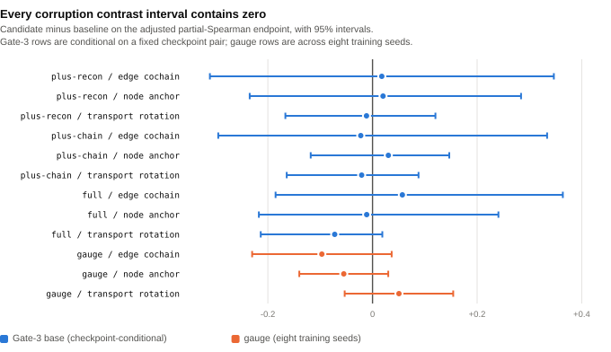

# Boundary Compatibility, Not Acyclicity: Which Structural Constraints Improve a Learned Conversion Between Structured Representations

**Sean Mahdavian**

Phillips Exeter Academy · ORCID
[0009-0000-8432-7825](https://orcid.org/0009-0000-8432-7825)

**Revision: 2026-08-24**

## Abstract

Moving data between structured representations — graphs, cell complexes, sheaves
— can lose information, and homological algebra supplies exact tools for measuring
what a map destroys. It is natural to hope that related constraints can also
*improve* a learned conversion when used as training objectives. We test a
boundary-of-boundary penalty and two motivated surrogates. Their behavior
differs, and two cheap analytic diagnostics illuminate the observed differences.

In a prospectively locked same-generator-family replication — with a disclosed
sum-versus-mean implementation deviation in the compatibility penalty — on 29
topologies of a generator built so that conversion is learnable and structural
defects vary, we fit one separate map per topology. The hypotheses, directions,
endpoint, training size, and weights were informed by earlier work on the same
family, whose seed identities were not retained; this is not an independent
confirmation or pristine preregistration. A
**boundary-compatibility** penalty improves a learned conversion by roughly two orders of
magnitude in held-out error: Bonferroni-adjusted interval [−2.802, −1.458] on the
paired `log10` ratio. The penalty is not leaked supervision — it is built from
the graph the model already observes, while the answer is withheld. In a
prespecified secondary analysis, **defect covaries with held-out error along the
compatibility-penalty path**: the mean within-topology Pearson correlation is
+0.854, with an unadjusted 95% interval [+0.831, +0.877], and is positive in 29
of 29 topologies. The common penalty weight drives both quantities, and the nine
fits within a topology are not independent observations; this path result does
not establish independent predictive information or off-path calibration.

The same campaign rejects one surrogate objective and finds no improvement from
another. A **singular-value cone surrogate**, `exp(−2·σ_min(W))`, does not
merely fail to help; it harms, adjusted interval [+0.102, +0.277]. For an
**RTD-inspired normalized pairwise-distance surrogate**, the adjusted interval
[−0.003, +0.039] includes zero. These are not mapping-cone homology and the
published RTD/SRTD statistic, respectively.

We identify two distinct mechanisms. In a second setting — selection among a
fixed family of twelve maps on a cellular annulus — every **hard decoded map** is
a signed permutation and therefore an isomorphism. Exact cone acyclicity cannot
distinguish those twelve vertices: the cone-only model identifies at chance while
all 6,000 hard decoded predictions have acyclic cones. Its differentiable
soft-mixture objective can vary during training, so this is a limitation of the
hard certificate, not a proof that the optimization signal is constant. In the
learned-conversion setting the singular-value surrogate monotonically rewards
inflating the smallest singular value beyond its ground-truth value and imposed a
harmful bias here. These pre-fit observations are diagnostics, not necessary or
sufficient conditions for improved finite-sample prediction.

We do not claim that homological structure teaches a model. We claim that one
specific penalty, derivable from the input, measurably improves a learned
conversion in this same-family replication. Along its prespecified weight path,
compatibility defect covaries with held-out error; the two tested surrogates do
not improve this task.

## 1. Introduction

### 1.1 The question

Given two structured representations of the same object, a conversion between
them is a **typed map**: a family of linear maps, one per degree, required to
commute with the boundary operators. Homological algebra measures what such a map
destroys (the kernel of the induced map on homology), what it cannot reach (the
cokernel), and whether it is an isomorphism (the acyclicity of its mapping cone).

The practical hope is that these measurements can serve as training signal — that
attaching one as a loss term will make a learned conversion better. This paper
asks which of them, if any, does.

### 1.2 What is and is not new

Learning higher-order structure from graphs is established: Differentiable Cell
Complex Module [5] learns cell probabilities jointly with a task, Differentiable
Lifting [6] learns liftings into cellular, simplicial, and combinatorial
complexes, and Neural Sheaf Diffusion [7] and Knowledge Sheaves [8] learn sheaf
restriction maps. Comparing paired representations through cross-barcodes is
likewise established: Representation Topology Divergence [1], its differentiable
autoencoder form [2], and the symmetric variant SRTD [3] are the direct basis for
our divergence reference, and a quotient-homology account of neural
representation [4] develops an adjacent algebraic view. Categorical deep
learning [9] and functor learning by gradient descent [10] ask what algebraic
structure a learned map should respect.

Our contribution is narrow and largely negative-with-a-mechanism:

1. A prospectively specified analysis in a **same-generator-family replication**
   showing that an input-derivable **boundary-compatibility penalty** improves a
   learned conversion under scarce paired data, subject to the disclosed
   protocol implementation deviation and outcome-informed design.
2. A prespecified secondary result, reported with an unadjusted interval, that
   the **compatibility defect covaries with held-out damage along the fixed
   compatibility-penalty path**, not that it independently predicts damage.
3. Multiplicity-controlled primary results showing harm from a
   **singular-value cone surrogate** and no detected improvement from an
   **RTD-inspired normalized pairwise-distance surrogate**.
4. Two **pre-fit diagnostic heuristics** for detecting constant or
   target-misaligned signals, and a benchmark generator in which homological
   defects genuinely vary.

This is not a new theorem or algorithm for equality-constrained least squares or
Hodge decomposition. Its narrow contribution is an evidence-traceable evaluation
of an input-derived cycle-subspace penalty on one deterministic synthetic
conversion family. We make no claim of priority over any cited system, and §3 is
positioning rather than systematic review.

## 2. Background and definitions

Each concept is stated in plain language before notation.

### 2.1 Graphs, cell complexes, and cellular sheaves

A **graph** records which pairs of objects are related. A **cell complex** adds
higher-dimensional pieces: on top of vertices (degree 0) and edges (degree 1) it
attaches faces (degree 2) glued along closed edge loops. A **cellular sheaf**
attaches a small vector space to each cell and a linear transport map to each
incidence, so data can move along the complex.

Formally a two-dimensional complex has boundary operators `d1` (edges to
vertices) and `d2` (faces to edges) satisfying `d1 d2 = 0`.

### 2.2 Typed maps and chain-map compatibility

A **typed map** carries degree-`n` data to degree-`n` data. It is a **chain map**
when it commutes with the boundaries — informally, when it does not tear the
complex. For a source with boundary `dC` and target with boundary `dD`,

    dD F1 − F0 dC = 0.

The left-hand side is the **chain-map defect**. Our historically named
`ExactChainMapLayer` parameterizes `(F0, F1)` inside the nullspace of that
expression, so the chain-map equation holds exactly rather than being penalized.
This use of “exactly” means equality to numerical tolerance; it does **not** mean
that a sequence is exact in the algebraic sense `im d_(n+1) = ker d_n`.

### 2.3 The implied complex

This paper's central move. When a model learns a lift `W` from edge signals to
face signals, `Wᵀ` is a candidate face boundary. The learned conversion therefore
**implies a complex** with boundaries `(B1, Wᵀ)`, and that complex is legitimate
only if `B1 Wᵀ = 0`. Every structural term below is written as a condition on the
implied complex rather than bolted on:

| campaign key | form | meaning |
|---|---|---|
| `exact` | `mean((B1 Wᵀ)²)` | boundary-of-boundary compatibility: the implied operators satisfy `d∘d = 0` |
| `cone` | `exp(−2·σ_min(W))` | singular-value cone surrogate that rewards increasing the smallest singular value |
| `rtd` | MSE between normalized pairwise distances | RTD-inspired distance-preservation surrogate |

All three short keys are retained because they were frozen in the campaign
protocol and machine-readable result. They must not be read as identities:
`exact` is **not exactness of a sequence** — `W = 0` already gives zero loss
without implying `im Wᵀ = ker B1`; `cone` is **not mapping-cone homology**;
and `rtd` is **not the published RTD or SRTD statistic** described in §2.5.
Exact mapping-cone homology and the corrected RTD/SRTD implementation appear
only as separate diagnostics elsewhere in this work.

### 2.4 Kernels, cokernels, and mapping cones

The **kernel** of the induced map on homology is what a conversion destroys; the
**cokernel** is what it cannot reach. A **mapping cone** is acyclic exactly when
the map is a quasi-isomorphism, and its homology is the sum of the two:

    dim H_n(cone F) = dim coker H_n(F) + dim ker H_(n−1)(F).

We verify this identity numerically on 24 maps: the twelve dihedral candidates
of §4.1 and twelve cycle-killing regression fixtures. It matters here because it
shows the cone **bundles** two directional facts into one number and loses their
separation — the kernel and cokernel are strictly more informative than the
acyclicity bit.

### 2.5 RTD and SRTD

**Representation Topology Divergence** compares two point clouds describing the
same items by tracking when topological features appear and disappear as a
distance threshold grows. **SRTD** is a symmetric variant. Our corrected
reference normalizes each dissimilarity matrix by its full-matrix 0.9 quantile,
reports persistence separately by degree, uses degree 1 for the published scalar,
and caps exact enumeration at 64 entities.

## 3. Related work

§1.2 and §2.5 cite the primary sources. In summary: RTD [1], RTD-AE [2], and
SRTD [3] define the divergence reference, with quotient homology [4] an adjacent
algebraic treatment; DCM [5] and DiffLift [6] are the closest precedents for
learning higher-order topological structure from graphs; Neural Sheaf
Diffusion [7] and Knowledge Sheaves [8] for learned sheaf transports; DeepMoE
[11], GMoE [12], GraphMETRO [13], and MvCGE [14] for per-example expert routing.

Categorical deep learning [9] argues architectures are usefully described as
algebras over a theory, and functor learning [10] gives an instance where the
learned object must preserve structure rather than merely fit data. Our
separate nullspace-constrained annulus map sits in that tradition operationally;
the continuous conversion experiment instead optimizes an unconstrained matrix
with a finite compatibility penalty. §10 states plainly that neither validates a
categorical claim.

Equality-constrained least squares is classical: Björck [15] surveys constrained
least-squares methods, and Eldén [16] develops a direct method for the
equality-constrained problem. Lim [17] places graph incidence operators, cycle
spaces, and Hodge Laplacians in a unified linear-algebraic treatment; Hoppe and
Schaub [18] connect edge flows and higher-order cell-complex structure. These
works explain why constraining or shrinking a linear estimator toward a correct
cycle subspace can reduce variance. Our contribution is not that mechanism; it
is the controlled evaluation and audit trail for deriving the soft penalty from
the observed input in this conversion generator.

## 4. Two settings

### 4.1 Selection over a fixed family

<figure>
  
  <figcaption><strong>Figure 1. The selection setting.</strong> A group element is planted in a six-sector cellular annulus (12 vertices, 18 edges, 6 faces, Betti (1, 1, 0)). The selector observes only identifying markers and never sees the target complex. It chooses one member of a fixed twelve-element basis, and the resulting typed map is scored four ways. The chain-map constraint is structural — it holds for every parameter value — so the residual is a numerical check, not a learned objective.</figcaption>
</figure>

Twelve dihedral maps act on the annulus. Each is built as a **signed permutation
in every degree**: `F0` permutes vertices, `F1` permutes edges with an
orientation sign, `F2` is fixed by matching the mapped boundary to a unique
oriented face. We verify numerically that all twelve satisfy `Fᵀ F = I` at
degrees 0, 1, and 2.

That property determines the exact hard-map certificate in this setting; it does
not determine the behavior of soft mixtures during training (§5).

### 4.2 Learned continuous conversion

A generator in which conversion is genuinely learnable. Its design is forced by a
conflict: the routing benchmark used elsewhere in this project deliberately hides
cell structure from the graph observation so a router cannot shortcut, which
makes conversion impossible by construction. Routing needs targets *not*
inferable from the graph; conversion needs them *inferable*. One generator cannot
serve both, so this is a separate one.

- The **2-cells are a cycle basis of the graph**, so the cell complex is
  determined by the graph rather than drawn beside it. Graph size and density
  vary, so the cycle rank varies, and the defect of a conversion varies with it.
- **Face activity thresholds the circulation** of the edge cochain around each
  cycle — exactly `B2ᵀ x1`. Integrating an edge feature around a cycle is the
  operation a converter must perform.
- **Sheaf transport** combines an endpoint frame difference with a per-edge
  twist. The frame difference telescopes to the identity around any closed cycle,
  so without the twist every holonomy would be trivially zero; the twist rides a
  separate edge channel so holonomy and face activity are not the same quantity
  twice.

**The learning task.** For each topology, fit a separate
`W: R^E → R^F` with the cycle basis `B2` **withheld**; there is no shared model
that generalizes `W` to a new topology. `B1` is observable because it is the
graph. Ground truth is `W = B2ᵀ`, a median of 242 free parameters across the 29
eligible topologies (range 30–770). The generator uses NetworkX
`cycle_basis`, whose basis coordinates are noncanonical. The
boundary-compatibility objective identifies the cycle **subspace**, not an
arbitrary choice of basis coordinates; paired targets supply the coordinate
convention for each fitted topology. The generator enforces `B1 B2 = 0`; the
degree-1 kernel of the canonical inclusion equals the graph's cycle rank.

## 5. Pre-fit diagnostics for structural objectives

Two inexpensive checks can expose obvious mismatches before training:

1. **Selection variability:** does the proposed quantity vary over the reachable
   candidates? A constant objective cannot distinguish among them.
2. **Target alignment:** is the ground-truth map at, or locally favored by, the
   objective's optimum? If not, the objective introduces bias away from the
   target.

These are diagnostic heuristics, not necessary or sufficient conditions for
better held-out prediction. In finite samples, even a target-misaligned
regularizer can improve generalization through a bias–variance tradeoff; a
target-aligned, nonconstant objective can still fail through optimization,
scaling, or model misspecification. The claims below therefore rest on the
algebraic proof for the annulus and the frozen empirical contrasts, not on the
screen alone.

### 5.1 The hard-map cone certificate is constant on annulus vertices

A mapping cone is acyclic exactly when its chain map is a quasi-isomorphism. Every
hard decoded candidate in §4.1 is a signed permutation, hence invertible, hence a
quasi-isomorphism. **Exact cone acyclicity therefore takes the same value on all
twelve decoded vertices.**

The generalization is broader than this annulus: **any hypothesis class of
invertible chain maps between fixed complexes has a constant cone-acyclicity
signal.** Acyclicity can certify that a candidate is a quasi-isomorphism; it
cannot select among candidates that already have that property.

This statement does **not** extend to the complete training trajectory. Training
uses `cone_soft_betti` on convex mixtures of the twelve maps; those mixtures
need not be invertible and the differentiable proxy can vary and provide
gradients. The RTD-style annulus loss is also not constant: it compares
cross-example distances of predicted and target typed representations, the
selectors vary by example, and soft mixtures are non-orthogonal. It consumes
target batch structure. Accordingly, the empirical chance accuracies in §7.4
cannot be deduced from a constancy theorem for either soft objective.

### 5.2 The singular-value surrogate is target-misaligned

In §4.2 the truth `W = B2ᵀ` has full row rank. Nevertheless,
`exp(−2·σ_min(W))` decreases monotonically as the smallest singular value
grows, so its optimum is not the finite ground-truth scale: it continually
rewards singular-value inflation. The term therefore imposes a directional bias.
The frozen experiment establishes that this bias harmed held-out error at the
tested weight; the analytic observation alone would not have proved harm.

### 5.3 Operational screen

`screen_structural_term` evaluates a candidate term on the ground truth and on
a sample of the hypothesis class, returning the operational labels
`truth-near-minimum-and-varies`, `truth-not-near-minimum`, or
`constant-over-the-hypothesis-class`. The labels are prompts for inspection,
not theorems about generalization. The exact annulus constancy result can be
established without fitting; all effect-size and held-out-performance claims
come from the reported campaigns.

## 6. Experimental design

### 6.1 Prospectively locked same-family replication

The conversion campaign was frozen in a protocol document committed **before
execution**: SHA-256
`503cc282f40d118ba1739c2afe1bfc77eaf2b1733baaddb91c0c3363e75ae2b8`, committed at
`d5d18af`, campaign run at `11644c6` from a clean worktree. No endpoint,
weight, decision rule, or sample size changed after the freeze. One objective
implementation did: the protocol writes the squared Frobenius norm
`‖B1 Wᵀ‖²`, while the runner executed the elementwise mean
`mean((B1 Wᵀ)²)`. Because the number of entries varies by topology, this is not
one global rescaling. The paper reports the executed objective and treats the
result as a prospectively specified analysis with a disclosed implementation
deviation, not a pristine protocol replication or independent confirmation.

The design was locked prospectively only relative to this run. Protocol 27 says
that the hypotheses, effect directions, endpoint, training-set size, and tested
weights were chosen after exploratory results on the same generator family.
Document 26 does not retain the exploratory seed identities, so possible overlap
with the frozen seed block 20261001–20261030 cannot be audited. Prospective
locking prevents changes after the freeze; it does not remove this
outcome-informed design history. Independent confirmation requires an untouched,
disjoint generator family or seed block.

| item | value |
|---|---|
| declared topologies | 30 (seeds 20261001–20261030) |
| eligible | **29**; seed 20261025 had fewer than three faces and was skipped, **not replaced** |
| training pairs | 16 |
| held-out pairs | 3072 |
| observation noise | 0.02 |
| optimiser | Adam, lr 0.05, 2500 steps, `W` initialised to zeros, float64 |
| weights | `exact` 3.0, `cone` 0.01, `rtd` 0.1 |

Weights were selected after exploratory work and then frozen before this run.
The publication bundle does not retain a machine-verifiable record of every
exploratory candidate or the exploratory seeds, so it does not claim that these
are globally or even exhaustively “best” weights or that exploratory and frozen
seed sets were disjoint. Weights are not comparable across terms because the
terms have different scales. The keys `exact`, `cone`, and `rtd` are frozen
historical labels defined and qualified in §2.3.

### 6.2 Endpoints and decisions

Primary endpoint is the paired quantity, one value per topology:

    d = log10( held-out MSE with term / held-out MSE without )

Negative means the term improves the model. Pairing removes topology variance.

**Multiplicity is adjusted.** The three primary contrasts form one family; the
governing interval is Bonferroni-corrected to two-sided 98.333%, giving a
family-wise error rate of 0.05. Unadjusted 95% intervals are reported alongside
and the adjusted interval governs. An exact two-sided sign test is reported as
distribution-free sensitivity and governs nothing.

H4 and H5 were prespecified but are **secondary analyses outside this
multiplicity-controlled family**; their Student-t 95% intervals are unadjusted.
H4 measures the mean within-topology Pearson correlation between the log
boundary-compatibility defect and log held-out error over nine fixed weights for
the historically named `exact` objective. All nine fits within a topology reuse
the same generated data and initialization and differ in the common driver,
penalty weight `lambda`. They are points on one deterministic regularization
path, not nine independent observations.

The frozen H5 endpoint contains a design error discovered during audit. It
divides the selected route's error by the per-trial minimum of those same two
route errors. Consequently every ratio is at least one and every `log10` ratio
is nonnegative, while the decision rule required an interval strictly below
zero. Support was impossible by construction. We preserve the result for
transparency but draw **no inferential routing conclusion** from H5.

The campaign ran once over all declared topologies. No interim analysis, no early
stop, no extension.

### 6.3 Hardware, software, provenance

Campaign: CPU, float64, PyTorch 2.13.0+cu130, Python 3.12.3. The annulus campaign
and all timing benchmarks ran on one NVIDIA GB10, Linux 6.17.0-1026-nvidia
aarch64, CUDA 13.0, deterministic algorithms enabled with
`CUBLAS_WORKSPACE_CONFIG=:4096:8`.

| item | value |
|---|---|
| annulus campaign commit | `8021292e97abfec91768f1b5437c883a42c29c60` |
| annulus launch fingerprint | `44408d7adf8467e594879b46e25a1cb7fd89a7e7a5d5f3446548bcbf3ed1096e` |
| annulus strict summary SHA-256 | `0cd0defb0b0d41b5f7563c364cfdda62cb72c5e5a845bdd5d1ab76a2e1cb953c` |
| routing campaign commit | `e69b07707950b6abe332366c51fe8c94254899f3` |
| scheduler steps completed | 56 of 56 |

The sealed scheduler receipt lists all 296 produced files with byte counts and
SHA-256 digests; all 296 verify against the on-disk artifacts.

## 7. Results

### 7.1 Boundary compatibility improves a learned conversion

| objective | weight | 95% interval | Bonferroni 98.33% | sign test | decision |
|---|---:|---|---|---:|---|
| boundary compatibility (`exact`) | 3.0 | [−2.628, −1.632] | **[−2.802, −1.458]** | <1e-6 | **improves** |
| singular-value cone surrogate (`cone`) | 0.01 | [+0.125, +0.254] | **[+0.102, +0.277]** | <1e-6 | **harms** |
| RTD-inspired distance surrogate (`rtd`) | 0.1 | [+0.002, +0.034] | [−0.003, +0.039] | 0.458 | **no detected improvement** |

<figure>
  
  <figcaption><strong>Figure 2. Three structural objectives under one protocol.</strong> Paired <code>log10</code>(held-out error with term / without), one value per topology, 29 topologies. The thick bar is the Bonferroni-adjusted 98.33% interval governing the primary decision; the thin bar is the unadjusted 95% interval. Boundary compatibility improves held-out error; the singular-value surrogate harms it; the RTD-inspired distance surrogate shows no detected improvement. The short labels in the graphic reproduce frozen campaign keys and do not identify <code>exact</code> with sequence exactness, <code>cone</code> with mapping-cone homology, or <code>rtd</code> with published RTD. Generated from <code>results/campaigns/conversion-campaign-v1-corrected.json</code>.</figcaption>
</figure>

Median `log10` ratio for boundary compatibility is −2.858, roughly a
**700-fold** reduction in held-out error; the mean is −2.130. The adjusted
interval lies far from zero.

The executed term is `mean((W B1ᵀ)²)`, which is zero at the truth because
`B2ᵀ B1ᵀ = (B1 B2)ᵀ = 0`. **It is not leaked supervision**: `B1` is the graph,
which the model observes; `B2` is the answer, which is withheld. Training still
optimizes all `F×E` entries of `W`; weight 3.0 penalizes but does not prohibit
off-cycle components.

### 7.2 Secondary analysis: covariation along the compatibility-penalty path

Within each topology, nine prespecified weights on the compatibility penalty
produce learned maps of varying quality. The endpoint is the correlation between
a map's boundary-compatibility defect and its held-out error along that path.

| quantity | value |
|---|---|
| mean within-topology correlation | **+0.854** |
| 95% interval | **[+0.831, +0.877]** |
| topologies with positive correlation | **29 / 29** |

This prespecified analysis is outside the three-contrast multiplicity family, so
its 95% interval is unadjusted. The same data and initialization are reused for
the nine fits, and `lambda` is a common driver of both compatibility defect and
held-out error. The nine path points are therefore not independent observations.
The result establishes covariation along this regularization path; it does not
show that defect carries independent predictive information, calibrates error
off path or on unseen topologies, isolates an intervention effect, or is causal.

### 7.3 The singular-value surrogate harms; the distance surrogate does not improve

Both belong to the multiplicity-controlled primary family. The singular-value
cone surrogate harms held-out error at the tested weight: its adjusted interval
lies entirely above zero. For the RTD-inspired normalized pairwise-distance
surrogate, the adjusted interval contains zero and the sign test is 0.458. This
supports **no detected improvement**, not equivalence, inertness, or a general
claim about published RTD/SRTD; no equivalence margin was prespecified.

§5.2 identifies the singular-value surrogate's scale-inflating bias; the frozen
contrast establishes that it harmed here. §5.1 proves a different fact in the
selection setting: exact cone acyclicity is constant across that finite class.

### 7.4 The selection setting, and why its nulls are weak

On the annulus, every objective containing task or reconstruction supervision
recovers the planted map exactly — transformation and cell-face accuracy 1.000 on
all five seeds, map MSE at 1e-16, engineering recovery gate passed **10 of 10**
applicable runs.

<figure>
  
  <figcaption><strong>Figure 3. Recovery by objective in the selection setting.</strong> Mean over five seeds. Any objective carrying task or reconstruction supervision saturates; the two single-loss controls sit at chance with map errors fifteen orders of magnitude larger. The RTD-only loss consumes target batch geometry and is not an unsupervised control. Generated from <code>results/summaries/identifiable-campaign-summary.json</code>.</figcaption>
</figure>

All 21 declared continuous contrast intervals contain zero, so adding the
annulus cone proxy or RTD-style training surrogate changed nothing. **That null
is weak evidence**: an analytic marker decoder also reaches 1.000, so the ceiling
was attainable without learning and no candidate could improve on a control
already at the maximum.

The two single-loss controls are descriptive negative results. `cone_only` reaches
transformation accuracy 0.0815 and `rtd_only` 0.0833 against a 0.0833 chance
baseline — **while producing acyclic cones in 6,000 of 6,000 evaluated examples
each**. This shows that the exact hard-map certificate is satisfied by all
decoded predictions while identification remains at chance. It does not show
that the differentiable cone proxy was constant during training, and it supplies
no analogous constancy proof for the RTD-style loss.

### 7.5 Specificity against generic regularisation remains open

Earlier exploratory notes report ridge, random-subspace, and nonlinear-link
checks, but no generating script or machine-readable result for those analyses
is preserved in the publication evidence. Their quantitative values are
therefore excluded from this paper. The primary campaign establishes an
improvement over the unpenalized fit; it does not establish that boundary
compatibility outperforms a tuned generic regularizer or a rank-matched random
subspace. A frozen, machine-recorded matched-control campaign is required before
making that specificity claim.

### 7.6 Routing: a flawed accuracy endpoint and a separate compute result

The prespecified H5 accuracy endpoint is **non-informative because its decision
rule is impossible to satisfy**. It divides the chosen route's error by the
per-trial minimum of the cell and graph errors, so every ratio is at least one
and every log ratio is nonnegative. An interval strictly below zero cannot
occur. The observed interval [−0.111, +0.382] reflects sampling uncertainty
around nonnegative observations; it is not a valid test that defect-based
routing fails. A post hoc comparison against always-cell also contains zero, but
it was neither the frozen endpoint nor multiplicity-adjusted and is descriptive
only.

Descriptively, the router picks the lower-error view on **25 of 28** trials, and
a perfect per-trial oracle buys only **1.36×** over always using the cell view
(median 2.022 against 2.741). These observations motivate a redesigned endpoint;
they do not rescue H5.

A separate routing result, from a different experiment, is retained as a
descriptive compute comparison rather than an accuracy claim.

<figure>
  
  <figcaption><strong>Figure 4. Trained routing inference latency on GB10.</strong> Median over 100 timed iterations averaged across five seeds; whiskers mark mean p95. Batch 64, bfloat16. All paths were timed in the plotted order inside one process, so residual thermal or allocator drift is confounded with path order. Generated from <code>results/summaries/compute-campaign.json</code>.</figcaption>
</figure>

Routed inference is **1.532 ± 0.035×** faster than dense three-expert evaluation
and **2.269 ± 0.043×** slower than the fastest single fixed route, with lower peak
allocated memory than dense in every seed. The defensible statement is that
routing saves compute against dense evaluation, not that it saves compute overall
and not that a measured defect selects the view.

An earlier five-seed campaign descriptively found a hard-minus-best-fixed
accuracy margin of +0.1098, 95% interval [+0.0953, +0.1243]. That result used privileged
latent-regime distillation and had target structured views available at
inference, and a disclosed pre-freeze procedural deviation makes it
protocol-aligned rather than pristine preregistration. It is a different
experiment from the defect-based routing tested here and the two must not be
conflated.

### 7.7 Corruption diagnostics

<figure>
  
  <figcaption><strong>Figure 5. Every corruption contrast interval contains zero.</strong> Nine Gate-3 base contrasts use a paired complete-block bootstrap conditional on a fixed checkpoint pair; three gauge contrasts use a Student-t interval with df = 7 across eight training seeds. No multiplicity adjustment. Generated from <code>results/gate3/paired_comparison_final.json</code> and <code>results/summaries/gauge-corruption-campaign.json</code>.</figcaption>
</figure>

These compare clean and corrupted **fixed-expert embeddings**. They never invoke a
translator or learned map and therefore cannot support or refute any conversion
claim. All twelve intervals contain zero.

## 8. Discussion

**The precise objective matters.** In one prospectively locked same-family
replication with a disclosed implementation deviation, boundary compatibility
improves held-out error, a singular-value cone surrogate harms it, and an
RTD-inspired normalized pairwise-distance surrogate shows no detected
improvement. Reporting only that
"homological structure helps" or "does not help" would erase the distinction
between a boundary-of-boundary penalty and two motivated but nonidentical
surrogates.

**Pre-fit inspection is useful but not dispositive.** §5's checks expose the
hard-map cone constancy result and the singular-value surrogate's scale-inflating
bias. They guide experimental design; they neither predict an effect size nor
replace held-out evaluation.

**Acyclicity is not correctness.** An acyclic mapping cone certifies that a chain
map is a quasi-isomorphism. In the annulus class every candidate is already an
invertible chain map, so that certificate is constant; a model trained on the
cone proxy alone can satisfy the certificate while failing to identify the
planted map.

**The cone bundles what the kernel and cokernel separate.** `dim H_n(cone) =
dim coker H_n + dim ker H_(n−1)` — the cone sums a directional pair and loses the
distinction between *destroyed* and *unreachable*. Where a measurement is wanted,
the unbundled pair is strictly more informative.

**The boundary-compatibility penalty favors the correct input-derived
subspace.** Its zero set has every row of `W` in the cycle space, which has
dimension `F` for these connected topologies. The executed finite-weight
regularizer merely shrinks off-cycle components; it does not hard-constrain the
optimizer, reduce the parameter count from `F×E`, or prove exactness. The result
shows that this cycle-subspace bias helped the generated targets and was
available from the observed graph. Whether the gain is specific to this bias
rather than generic regularization remains open.

## 9. Limitations

- **One synthetic linear family.** 29 topologies and one training-set size.
  Nothing transfers automatically to real data or nonlinear conversions.
- **No unseen-topology learning.** A separate `W` is fitted and evaluated
  within each topology. The campaign does not learn a shared converter that
  generalizes to a new graph.
- **Noncanonical target coordinates.** NetworkX chooses one cycle basis among
  many. The penalty identifies the cycle subspace; paired labels identify that
  run's arbitrary basis coordinates.
- **Protocol implementation deviation.** The runner used an elementwise mean
  where frozen protocol 27 wrote a Frobenius sum. The result is not a pristine
  protocol replication.
- **Regularization specificity is open.** No machine-verifiable tuned-ridge or
  rank-matched random-subspace campaign is in the publication evidence.
- **Outcome-informed same-family design.** The hypotheses, directions, endpoint,
  training size, and weights were selected after exploration on the same
  generator family. Exploratory seed identities were not retained, so overlap
  with the frozen 20261001–20261030 block is unverifiable. This is prospectively
  locked replication, not independent confirmation; an untouched disjoint
  family or seed block remains necessary.
- **The selection setting saturates.** Six of eight objectives reach exactly
  1.000, so its structural nulls cannot detect improvement. Its RTD-only loss
  consumes target batch geometry and is not an unsupervised control.
- **Five seeds in the annulus campaign**, where the exact two-sided sign test
  floor is p = 0.0625 and can never be decisive.
- **Defect-based routing accuracy is unresolved.** The frozen H5 decision was
  impossible to satisfy because its per-trial oracle denominator forces every
  endpoint observation to be nonnegative. The 1.36× oracle ceiling and 25/28
  route selections are descriptive only.
- **Privileged supervision** in the historical routing campaign, and
  **target-view translators** in the historical conversion modules, which consumed
  target structure and are not conversions.
- **Timing caveats.** All paths timed in fixed order inside one process; raw
  per-iteration timings not retained; identifiable runner reports p90 and routing
  runner p95, never pooled.
- **Secondary analyses are unadjusted.** C1, H5, the routing campaign, and the
  corruption diagnostics lie outside the three primary conversion contrasts.
- **C1 is a regularization-path association.** Within each topology, its nine
  fits share data and initialization and vary the common driver `lambda`. They
  are not independent observations, so C1 does not establish independent
  predictive information or off-path calibration.
- **No equivalence test.** The RTD-inspired surrogate interval includes zero,
  but no equivalence margin was specified.
- **Artifact boundaries.** The 8.8 GB `artifacts/` tree is untracked; tracked
  evidence is the curated `results/` bundle.

## 10. Claim boundary

This work provides evidence, on one synthetic family under a prospectively
locked same-family replication with a disclosed implementation deviation, that
an input-derived boundary-compatibility penalty improves a learned conversion.
The hypotheses, directions, endpoint, training size, and weights were
outcome-informed by same-family exploration, and exploratory seed overlap is
unverifiable; this is not independent confirmation. A prespecified, unadjusted
secondary analysis finds that defect covaries with held-out error along the
fixed penalty path, where `lambda` is a common driver. In the same primary family, a
singular-value cone surrogate harms held-out performance, while an RTD-inspired
normalized pairwise-distance surrogate shows no detected improvement.

It does **not** establish:

- any general conclusion about mapping-cone homology or published RTD/SRTD as
  training objectives;
- that a measured defect can select a representation; the frozen test of this
  claim had an impossible decision rule;
- conversion quality on real or out-of-distribution data;
- independent replication on an untouched generator family or disjoint seed
  block;
- independent predictive information or off-path calibration from the C1
  regularization-path association;
- general equivalence between graphs, cellular complexes, and sheaves;
- a general method for learning quasi-isomorphisms — the annulus candidates are
  preconstructed invertible chain maps, and the verified chain-map identity uses
  a fixed 1e-5 tolerance;
- any Langlands, eigensheaf, Fourier–Mukai, or category-theoretic result.
  Imposing a chain-map constraint by construction is not a categorical claim in
  the sense of [9] or [10]: we fix one finite hypothesis class by hand in §4.1,
  while §4.2 optimizes a full matrix under a finite soft penalty rather than
  learning inside a fixed nullspace.

## 11. Code and data availability

**Availability status.** The project repository is private and is licensed
proprietarily (Copyright © 2026 Sean Mahdavian, all rights reserved). This is
**not an open-source or open-data release.**

**Access for peer review.** The source, configurations, frozen protocols, and
compact evidence bundle are made available to editors and reviewers for the
duration of review through a read-only snapshot supplied to the handling editor.
The snapshot is built by `scripts/build_review_snapshot.py`, which archives the
repository at one commit together with the tracked `results/` bundle and its
manifest and refuses to run against an uncommitted worktree. Reviewers can
rehash the compact evidence, trace every reported value to it, rerun the CPU
conversion campaign, run the test suite, and regenerate the figures and paper.
The snapshot intentionally excludes the 8.8 GB raw `artifacts/` tree. A full
rerun of the GB10 annulus campaign or trained-checkpoint benchmarks therefore
requires separately supplied raw artifacts/checkpoints and compatible GPU
hardware. Access is granted for review only and confers no license to
redistribute or reuse the material; the terms in `LICENSE` continue to apply.

Readers outside the review process should treat this section as a description of
what exists and how it is organised, not as a download.

All code, configurations, and compact evidence are in that repository. The
tracked bundle under `results/` contains 49 files with a `MANIFEST.json` recording
path, byte count, SHA-256, generating commit, and generating command for each.

| location | contents |
|---|---|
| `results/campaigns/` | the frozen conversion campaign record |
| `results/summaries/` | strict compact summaries for the annulus, gauge, compute, and routing campaigns |
| `results/gate3/`, `results/gate3g/` | gate decisions and per-batch corruption-report derivatives |
| `results/benchmarks/` | ten identifiable and five routing trained benchmark records |

Corruption reports are exported as per-batch derivatives: the `per_example` array
is dropped and the `per_batch` array — the unit of analysis — retained. This is
lossless for every published statistic, verified by recomputing the adjusted
partial Spearman from retained rows and matching to 1e-15.

Synthetic generators are deterministic given the committed configs and seeds; no
external dataset is required.

## 12. Reproducibility

The reviewer snapshot supports the following checks without a GPU:

```bash
python scripts/run_conversion_campaign.py \
  --output /tmp/conversion-campaign.json
python scripts/export_publication_evidence.py --verify-only
python scripts/render_figures.py
python scripts/render_paper.py
```

With separately supplied raw campaign artifacts and checkpoints, the full
private workspace additionally supports:

```bash
python scripts/summarize_gauge_corruption_campaign.py \
  --output results/summaries/gauge-corruption-campaign.json
python scripts/summarize_compute_campaign.py \
  --output results/summaries/compute-campaign.json
```

Each summarizer revalidates provenance before aggregating and fails closed on any
hash, seed, pairing, schema, or receipt mismatch. The exporter works from an
explicit allowlist and refuses checkpoints, prediction dumps, histories, logs, and
caches. Its manifest carries no timestamp, so re-exporting unchanged evidence
reproduces the bundle byte for byte.

Thus the compact snapshot supports verification of every reported value and a
fresh CPU conversion run. It does not, by itself, support a fresh GB10 campaign
or checkpoint benchmark; those require the excluded raw artifacts and hardware
described in §11.

The paper PDF is rendered with `python scripts/render_paper.py`; figures are
regenerated from tracked evidence with `python scripts/render_figures.py`.

## 13. Declarations

**Author contributions.** Sean Mahdavian designed and implemented the system, ran
the campaigns, and wrote the manuscript.

**Affiliation.** Phillips Exeter Academy.

**ORCID.** [0009-0000-8432-7825](https://orcid.org/0009-0000-8432-7825).

**Funding.** This work received no external funding.

**Competing interests.** The author declares no competing interests.

**License.** The software, source code, documentation, and evidence described
here are made available under a proprietary license, Copyright © 2026 Sean
Mahdavian, all rights reserved. The terms are in the repository's `LICENSE`.
**This is not an open-source or open-data release**, and §11 should be read
accordingly.

**Ethics.** Every experiment reported here uses synthetic data generated by
committed deterministic code. No human subjects, personal data, or personally
identifiable information are involved. Compute is small: the annulus campaign is
25.8 minutes of GPU time and the conversion campaign runs on CPU.

A molecular transfer experiment on the public OGBG-MOLHIV benchmark was run
earlier in this project and is **deliberately not reported here**, because it
answers a different question from the one this paper asks. Its result — the
ring-lift route losing to the graph route, with later variants contaminated by
repeated inspection of the official test split — is recorded in the project's
claims ledger as C6.

**Reporting.** Null and negative results are reported in the body rather than an
appendix, and every quantitative experimental result is traceable to a tracked
machine-readable file under `results/`.

## References

1. Barannikov, Trofimov, Balabin, and Burnaev.
   [Representation Topology Divergence: A Method for Comparing Neural Network
   Representations](https://proceedings.mlr.press/v162/barannikov22a.html).
   ICML, 2022.
2. Trofimov, Cherniavskii, Tulchinskii, Balabin, Burnaev, and Barannikov.
   [Learning Topology-Preserving Data
   Representations](https://openreview.net/forum?id=lIu-ixf-Tzf).
   ICLR, 2023.
3. Wang and Hu.
   [Symmetric Divergence and Normalized Similarity: A Unified Topological
   Framework for Representation Analysis](https://arxiv.org/abs/2606.06342).
   TMLR, 2026. arXiv:2606.06342.
4. Beshkov.
   [A Quotient Homology Theory of Representation in Neural
   Networks](https://openreview.net/forum?id=RluspxztzS).
   TMLR, 2026.
5. Battiloro, Spinelli, Telyatnikov, Bronstein, Scardapane, and Di Lorenzo.
   [From Latent Graph to Latent Topology Inference: Differentiable Cell Complex
   Module](https://arxiv.org/abs/2305.16174).
   ICLR, 2024.
6. Franco, Duarte, Nikitin, Ponti, Mesquita, and Souza.
   [Differentiable Lifting for Topological Neural
   Networks](https://neurips.cc/virtual/2025/123646).
   NeurIPS 2025 Workshop on Non-Euclidean Foundation Models and Geometric
   Learning. Workshop poster, not a main-conference paper.
7. Bodnar, Di Giovanni, Chamberlain, Liò, and Bronstein.
   [Neural Sheaf Diffusion: A Topological Perspective on Heterophily and
   Oversmoothing in GNNs](https://arxiv.org/abs/2202.04579).
   NeurIPS, 2022.
8. Gebhart, Hansen, and Schrater.
   [Knowledge Sheaves: A Sheaf-Theoretic Framework for Knowledge Graph
   Embedding](https://proceedings.mlr.press/v206/gebhart23a.html).
   AISTATS, 2023.
9. Gavranović, Lessard, Dudzik, von Glehn, Madeira Araújo, and Veličković.
   [Position: Categorical Deep Learning is an Algebraic Theory of All
   Architectures](https://proceedings.mlr.press/v235/gavranovic24a.html).
   ICML, 2024.
10. Gavranović.
    [Learning Functors using Gradient Descent](https://arxiv.org/abs/2009.06837).
    EPTCS 323, 2020.
11. Wang, Yu, Dunlap, Ma, Wang, Mirhoseini, Darrell, and Gonzalez.
    [Deep Mixture of Experts via Shallow
    Embedding](https://proceedings.mlr.press/v115/wang20d.html).
    UAI, 2020.
12. H. Wang, Jiang, You, Han, Liu, Srinivasa, Kompella, and Z. Wang.
    [Graph Mixture of Experts: Learning on Large-Scale Graphs with Explicit
    Diversity
    Modeling](https://papers.nips.cc/paper_files/paper/2023/hash/9f4064d145bad5e361206c3303bda7b8-Abstract-Conference.html).
    NeurIPS, 2023.
13. S. Wu, Cao, Ribeiro, Zou, and Leskovec.
    [GraphMETRO: Mitigating Complex Graph Distribution Shifts via Mixture of
    Aligned
    Experts](https://papers.nips.cc/paper_files/paper/2024/hash/11c892a9fcc430cc0f4c7d457e5d60ea-Abstract-Conference.html).
    NeurIPS, 2024.
14. Z. Wu, Cai, Zhang, Lu, Chen, Zhuang, and Wang.
   [Where Graph Meets Heterogeneity: Multi-View Collaborative Graph
   Experts](https://neurips.cc/virtual/2025/poster/116976).
   NeurIPS, 2025.
15. Björck.
   [Numerical Methods for Least Squares Problems, Chapter 5: Constrained Least
   Squares Problems](https://epubs.siam.org/doi/10.1137/1.9781611971484.ch5).
   SIAM, 1996.
16. Eldén.
   [Perturbation Theory for the Least Squares Problem with Linear Equality
   Constraints](https://epubs.siam.org/doi/10.1137/0717028).
   SIAM Journal on Numerical Analysis 17(3):338–350, 1980.
17. Lim.
   [Hodge Laplacians on
   Graphs](https://epubs.siam.org/doi/10.1137/18M1223101).
   SIAM Review 62(3):685–715, 2020.
18. Hoppe and Schaub.
   [Representing Edge Flows on Graphs via Sparse Cell
   Complexes](https://proceedings.mlr.press/v231/hoppe24a.html).
   Proceedings of the Second Learning on Graphs Conference, PMLR 231:1:1–1:22,
   2024.
